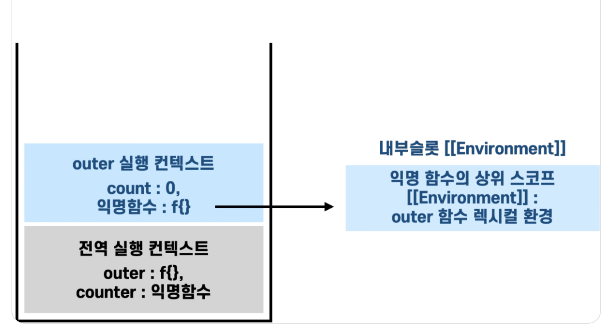

# 1. 자바의 컴파일 과정과 JVM이란?


자바의 큰 특징중 하나는 플랫폼(CPU나 OS 등) 컴파일된 코드가 독립적이다!
이것이 가능한 이유는 JVM(자바 가상 머신) 때문임

## 자바 코드 실행 과정


1. 개발자가 자바 소스를 작성함
2. 자바 컴파일러가 바이트코드로 변환함(.class)
3. JVM 안에 클래스 로더가 동적로딩을 통해 런타임 데이터 영역(JVM의 메모리)에 코드를 올림
4. 실행 엔진이 이 바이트 코드를 실행함

## 클래스 로더의 세부 동작

1. 로드: 클래스 파일을 가져와서 JVM 메모리에 로드함
2. 검증: 자바 언어 명세 및 JVM 명세에 명시된 대로 구성되어 있는지 검사함 (문법이나 규칙 잘 지켰는가)
3. 준비: 클래스가 필요로 하는 메모리를 할당함 (필드, 메서드, 인터페이스 등)
4. 분석: 클래스의 상수 풀 내 모든 심볼릭 레퍼런스를 다이렉트 레퍼런스로 변경함
5. 초기화: 클래수 변수들을 적절한 값으로 초기화 함 (static 필드)

**심볼릭 레퍼런스** : 우리가 코드를 작성하면서 사용한 클래스나 필드 메서드 이름
**다이렉트 레퍼런스** : 실제 메모리 주소를 의미함 0x7f8c4000

## 실행엔진의 구성 요소

### Interpreter

- **동작**: 바이트 코드를 한 줄씩 읽어 실행
- **단점**: 실행 속도가 느림

### JIT(Just-In-Time) Compiler

- **동작**: 인터프리터 방식으로 실행하다가 적절한 시점에 바이트 코드 전체를 컴파일
- **장점**: 한 번 컴파일된 코드는 캐시에 보관하여 다음 실행 시 빠르게 수행
- **단점**: 컴파일 시간이 오래 걸림 (한 번만 실행되는 코드는 인터프리팅이 유리)

# 모범답안

"JVM은 자바 바이트코드를 실행하는 가상머신으로, 플랫폼 독립성을 제공합니다. 자바 소스코드는 javac에 의해 바이트코드로 컴파일되고, 클래스 로더가 이를 메모리(런타임 데이터 영역)에 로드한 후, 실행 엔진이 인터프리터와 JIT 컴파일러를 통해 실행합니다."

---

# 2. JVM의 메모리 구조와 GC에 대해서 설명

## JVM 메모리 구조

JVM의 메모리 구조는 크게 **5개 영역**으로 나누어진다


### 1. Method Area (메소드 영역)

- **저장 내용**: 클래스 정보, 메소드 정보, static 변수, 상수(final) 정보
- **특징**: 모든 스레드가 공유하는 영역으로, 프로그램 시작 시 로드되어 종료까지 유지
- **예시**: `public class User { static int count; }` 에서 User 클래스 정보와 count 변수가 저장

### 2. Heap Area (힙 영역)

- **저장 내용**: `new` 키워드로 생성한 객체와 배열
- **특징**: 모든 스레드가 공유하며, **GC의 주요 대상**
- **구조**: New Generation(Eden, Survivor1, Survivor2) + Old Generation
- **예시**: `User user = new User();` 에서 실제 User 객체가 저장되는 공간

### 3. Stack Area (스택 영역)

- **저장 내용**: 메소드 호출 시 생성되는 지역변수, 매개변수, 리턴값
- **특징**: 각 스레드마다 독립적으로 생성, LIFO 구조
- **동작**: 메소드 호출 시 스택 프레임 생성 → 메소드 종료 시 자동 제거
- **예시**: 메소드 내 `int num = 10;` 같은 지역변수와 Heap 객체의 **주소값** 저장

### 4. PC Register (프로그램 카운터)

- **저장 내용**: 현재 실행 중인 JVM 명령어의 주소
- **특징**: 각 스레드마다 독립적으로 생성

### 5. Native Method Stack

- **저장 내용**: Java 외 다른 언어(C/C++)로 작성된 메소드 정보
- **특징**: JNI(Java Native Interface) 호출 시 사용

## GC란?

**참조되지 않는 객체들의 메모리를 자동으로 회수하는 JVM의 메모리 관리 기법**입니다. Java는 개발자가 직접 메모리를 해제하지 않기 때문에 GC가 이 역할을 담당함

## GC 동작 원리

**Reachability** 개념을 사용하여 Root Set(지역변수, static 변수 등)에서 참조 가능한 객체와 그렇지 않은 객체를 구분해 unreachable 객체들을 메모리에서 제거합니다.

## Heap 영역 구조와 GC 과정

### 1. New Generation

- **Eden**: 새로 생성된 객체가 최초로 할당되는 영역
- **Survivor1, Survivor2**: Eden에서 살아남은 객체들이 이동하는 영역 (둘 중 하나는 항상 비어있음)

### 2. Old Generation

- **Old**: New Generation에서 오랫동안 살아남은 객체들이 이동하는 영역

## GC 종류

### Minor GC

- **발생 위치**: New Generation (Eden + Survivor 영역)
- **동작 과정**:
  1. Eden 영역이 가득 차면 GC 발생
  2. 살아있는 객체는 Survivor 영역으로 이동
  3. 이 과정을 반복하며 일정 횟수 이상 살아남은 객체는 Old 영역으로 이동
- **특징**: 빠른 속도, 빈번하게 발생

### Major GC (Full GC)

- **발생 위치**: Old Generation 전체
- **발생 조건**: Old 영역의 메모리가 부족할 때
- **특징**:
  - **Stop-the-World**: GC 실행 중 모든 애플리케이션 스레드 일시 정지
  - 처리 시간이 길어 성능에 직접적 영향
  - Minor GC보다 상대적으로 드물게 발생

# 모범답안

"JVM 메모리는 Method Area, Heap, Stack, PC Register, Native Method Stack으로 구성됩니다. Heap은 객체가 저장되는 영역으로 GC의 주요 대상이며, Minor GC는 New Generation에서, Major GC는 Old Generation에서 발생합니다."

---

# 3. Java 버전별 주요 차이점 설명

## Java 8(2014)

- 람다 표현식, 스트림 API을 통해 함수형 프로그래밍 지원
- Optional 클래스로 null 값을 안전하게 처리하게 가능
- LocalDate,time등 쓰레드 세이프한 날짜 API 추가
- 인터페이스에 디폴트 메서드 정의 가능

## Java 11(2018)

- HTTP 클라이언트 표준화
- String의 새 메서드 추가(isblank, repaet,lines)
- GC 개선

### Java 17 (2021)

- 봉인 클래스 등 객체지향 기능 강화
- 패턴 매칭 개선
- GC 및 성능 추가 개선

### Java 21 (2023)

- Virtual Thread로 동시성 프로그래밍 혁신
- String Templates 등 편의 기능 추가
- Record Pattern Matching 등 패턴 매칭 강화

# 모범답안

"Java 8은 람다와 스트림으로 함수형 프로그래밍을 도입한 획기적인 버전입니다. Java 11은 HTTP 클라이언트와 String 개선, Java 17은 봉인 클래스와 패턴 매칭, Java 21은 Virtual Thread로 동시성을 개선했습니다"

---

# 4. 클로저(Closure)란 무엇이고 언제 사용하나요?

```js
function outer() {
  let count = 0;
  return function () {
    count++;
    console.log(count);
  };
}

const counter = outer();
counter(); // 1
counter(); // 2
```

`outer()`라는 함수를 호출하면 반환된 익명함수를 `counter`라는 변수에 저장함
단순하게 생각하면 `outer()` 함수의 실행이 종료되었기 때문에 내부에 `count`라는 변수도 사라졌다고 생각할 수 있지만 클로저의 특성 때문에 외부 함수의 환경을 기억하고 있다!
여전히 내부 함수(익명함수)가 count 변수를 참조하고 있는거임



# 모범답안

"클로저는 함수가 선언될 당시의 렉시컬 환경을 기억하여, 외부 스코프의 변수에 접근할 수 있게 하는 기능입니다. 주로 데이터 은닉, 모듈 패턴, 콜백에서의 상태 유지 등에 사용됩니다."

---

# 5. 호이스팅과 var, let, const의 차이점을 설명해보세요

### 호이스팅(Hoisting)

**변수 선언과 함수 선언이 코드 실행 전에 해당 스코프의 최상단으로 끌어올려지는 JavaScript의 동작 방식**

### var, let, const 차이점

| 특징     | var       | let     | const       |
| -------- | --------- | ------- | ----------- |
| 스코프   | 함수      | 블록    | 블록        |
| 재선언   | 가능      | 불가    | 불가        |
| 재할당   | 가능      | 가능    | 불가        |
| 호이스팅 | O         | O (TDZ) | O (TDZ)     |
| 초기화   | undefined | 필요시  | 선언시 필수 |

### TDZ (Temporal Dead Zone)

let과 const는 선언 전까지 접근할 수 없는 구간이 존재하는데 이걸 TDZ라고 부름

# 모범답안

"호이스팅은 변수와 함수 선언이 스코프 최상단으로 끌어올려지는 동작입니다. var는 함수 스코프를 가지며 재선언/재할당이 가능하고, let과 const는 블록 스코프를 가지며 TDZ로 인해 선언 전 접근이 불가능합니다. const는 재할당이 불가능하며 선언 시 초기화가 필수입니다."

---

# 6. 제어의 역전과 의존성 주입에 대해 설명해보세요

### IoC (Inversion of Control) - 제어의 역전

**객체의 생성, 생명주기 관리의 제어권을 개발자가 아닌 프레임워크(Spring Container)가 담당하는 설계 원칙**

### DI (Dependency Injection) - 의존성 주입

**객체 간의 의존관계를 외부에서 주입해주는 설계 패턴**
3가지가 존재함

- 필드주입
- 수정자(setter) 주입
- 생성자 주입(가장 권장)

### DI의 장점

1. **결합도 감소**: 구체적인 구현에 의존하지 않음
2. **테스트 용이성**: Mock 객체 주입으로 단위 테스트 쉬움
3. **코드 재사용성**: 인터페이스 기반으로 다양한 구현체 교체 가능

# 모범답안

"IoC는 객체의 생성과 생명주기 관리 제어권을 개발자에서 프레임워크로 역전시키는 원칙이고, DI는 이를 구현하는 방법으로 외부에서 의존성을 주입하는 패턴입니다. Spring에서는 생성자 주입을 권장하며, 결합도를 낮추고 테스트하기 쉬운 코드를 만들 수 있습니다."

---

# 7. useState와 useEffect 훅의 동작원리를 설명해보세요

# 모범답안

"useState는 함수형 컴포넌트에서 상태를 관리하는 Hook으로, 상태값과 업데이트 함수를 반환합니다. useEffect는 사이드 이펙트를 처리하는 Hook으로, 의존성 배열을 통해 실행 조건을 제어하고 클린업 함수로 정리 작업을 수행합니다."

---

# 8. React 의 virtual DOM의 개념과 동작원리를 설명해주세요

### Virtual DOM 동작 원리

#### 1. Virtual DOM 생성

JSX로 작성된 컴포넌트가 Virtual DOM 객체로 변환

```javascript
// JSX
const element = <div className="container">Hello World</div>;

// Virtual DOM 객체로 변환
const virtualElement = {
  type: "div",
  props: {
    className: "container",
    children: "Hello World",
  },
};
```

#### 2. Diffing (차이 계산)

이전 Virtual DOM과 새로운 Virtual DOM을 비교하여 변경점 탐지

#### 3. Reconciliation (재조정)

변경된 부분만 실제 DOM에 반영

### Virtual DOM의 장점

- **성능 최적화**: 배치 업데이트로 DOM 조작 최소화
- **예측 가능성**: 선언적 프로그래밍 방식
- **크로스 브라우저**: 브라우저 간 호환성 문제 해결

# 모범답안

"Virtual DOM은 실제 DOM의 가벼운 JavaScript 표현으로, React가 UI 상태를 메모리에서 관리하는 방식입니다. 상태 변경 시 새로운 Virtual DOM과 이전 Virtual DOM을 비교하는 Diffing 과정을 거쳐 변경된 부분만 실제 DOM에 반영하여 성능을 최적화합니다."

---

# 9. HTTP와 HTTPS의 차이점과 HTTPS의 동작원리

### HTTP vs HTTPS 차이점

| 구분   | HTTP      | HTTPS          |
| ------ | --------- | -------------- |
| 포트   | 80        | 443            |
| 보안   | 평문 통신 | SSL/TLS 암호화 |
| 인증   | 없음      | 서버 인증 제공 |
| 무결성 | 보장 안됨 | 보장됨         |

### HTTPS 동작 원리

#### 1. TCP Handshake

클라이언트-서버 간 연결 수립

#### 2. TLS Handshake

1. **Client Hello**: 지원하는 암호화 방식 전송
2. **Server Hello + Certificate**: 인증서와 공개키 전송
3. **Certificate Verification**: 클라이언트가 인증서 검증
4. **Key Exchange**: 비대칭키로 대칭키를 안전하게 교환
5. **암호화 통신**: 대칭키로 실제 데이터 암호화

### HTTPS의 보안 이점

1. **기밀성**: 데이터 암호화로 도청 방지
2. **무결성**: 데이터 변조 탐지
3. **인증**: 서버가 신뢰할 수 있는 주체임을 증명

# 모범답안

"HTTP는 평문 통신하는 프로토콜이고, HTTPS는 SSL/TLS로 암호화된 HTTP입니다. HTTPS는 TLS handshake를 통해 서버 인증서를 검증하고 비대칭키로 대칭키를 안전하게 교환한 후 대칭키로 실제 데이터를 암호화합니다. 이를 통해 기밀성, 무결성, 인증을 제공합니다."

---

# 10. XSS, CSRF에 대해서 설명하고 대비책에는 어떤것이 있나요

### XSS (Cross-Site Scripting)

**악성 스크립트를 웹 페이지에 삽입하여 사용자의 브라우저에서 실행시키는 공격**

#### XSS 방어 방법

```javascript
// 1. 입력값 이스케이핑
function escapeHtml(text) {
  const map = {
    "&": "&amp;",
    "<": "&lt;",
    ">": "&gt;",
    '"': "&quot;",
    "'": "&#039;",
  };
  return text.replace(/[&<>"']/g, (m) => map[m]);
}

// 2. CSP (Content Security Policy) 설정
res.setHeader(
  "Content-Security-Policy",
  "default-src 'self'; script-src 'self';"
);

// 3. 안전한 DOM 조작
element.textContent = userInput; // innerHTML 대신 사용
```

### CSRF (Cross-Site Request Forgery)

**사용자가 인증된 상태에서 의도하지 않은 요청을 다른 사이트에서 실행하도록 만드는 공격**

#### CSRF 방어 방법

```javascript
// 1. CSRF Token 사용
const csrfToken = generateCSRFToken();
req.session.csrfToken = csrfToken;

// 2. SameSite 쿠키 설정
app.use(
  session({
    cookie: {
      sameSite: "strict",
      secure: true,
      httpOnly: true,
    },
  })
);

// 3. Referer 검증
if (!referer || !referer.startsWith(`https://${host}`)) {
  return res.status(403).send("Invalid referer");
}
```

# 모범답안

"XSS는 악성 스크립트를 웹페이지에 삽입하여 실행시키는 공격으로, 입력값 이스케이핑, CSP 설정으로 방어할 수 있습니다. CSRF는 인증된 사용자가 의도하지 않은 요청을 실행하도록 하는 공격으로, CSRF 토큰, SameSite 쿠키, Referer 검증으로 방어합니다."

---

# 11. REST API란 무엇인가요?

**REST(Representational State Transfer)는 웹의 기존 기술과 HTTP 프로토콜을 그대로 활용하는 아키텍처 스타일**

### REST 설계 원칙

1. **자원(Resource)**: URI로 자원을 식별
2. **행위(Verb)**: HTTP Method로 행위를 표현
3. **표현(Representation)**: JSON, XML 등으로 데이터 표현

### RESTful 설계 예시

```
GET    /users          # 사용자 목록 조회
GET    /users/123      # 특정 사용자 조회
POST   /users          # 사용자 생성
PUT    /users/123      # 사용자 전체 수정
PATCH  /users/123      # 사용자 부분 수정
DELETE /users/123      # 사용자 삭제
```

### HTTP 상태 코드 활용

```javascript
// 적절한 상태 코드 사용
200: 'OK - 성공적인 GET, PUT, PATCH'
201: 'Created - 성공적인 POST'
204: 'No Content - 성공적인 DELETE'
400: 'Bad Request - 잘못된 요청'
401: 'Unauthorized - 인증 필요'
404: 'Not Found - 리소스 없음'
500: 'Internal Server Error - 서버 오류'
```

### REST의 제약조건

1. **Client-Server**: 관심사 분리
2. **Stateless**: 무상태성
3. **Cacheable**: 캐시 가능
4. **Uniform Interface**: 통일된 인터페이스
5. **Layered System**: 계층화
6. **Code on Demand**: 선택적

# 모범답안

"REST API는 HTTP 프로토콜을 활용한 아키텍처 스타일로, 자원을 URI로 식별하고 HTTP 메서드로 행위를 표현합니다. 무상태성, 캐시 가능성 등의 제약조건을 따르며, 올바른 상태 코드 사용과 일관된 URI 설계를 통해 직관적이고 사용하기 쉬운 API를 구축할 수 있습니다."

---

# 12. 쿠키와 세션

### 쿠키 (Cookie)

**클라이언트(브라우저)에 저장되는 작은 데이터 조각**

#### 쿠키 특징

- **저장 위치**: 클라이언트 브라우저
- **용량 제한**: 도메인당 4KB
- **보안**: 클라이언트에서 조작 가능 (취약)

```javascript
// 쿠키 설정
res.cookie("username", "john", {
  maxAge: 24 * 60 * 60 * 1000, // 24시간
  httpOnly: true, // XSS 방지
  secure: true, // HTTPS에서만
  sameSite: "strict", // CSRF 방지
});

// 쿠키 읽기
const username = req.cookies.username;
```

### 세션 (Session)

**서버에 저장되는 사용자 상태 정보**

#### 세션 특징

- **저장 위치**: 서버 메모리/DB
- **용량 제한**: 서버 자원에 의존
- **보안**: 서버에서 관리 (상대적으로 안전)

```javascript
// 세션 설정
app.use(
  session({
    secret: "secret-key",
    resave: false,
    saveUninitialized: false,
    cookie: { maxAge: 24 * 60 * 60 * 1000 },
  })
);

// 로그인 처리
req.session.userId = user.id;
req.session.username = user.username;

// 로그아웃
req.session.destroy();
```

### 쿠키 vs 세션 비교

| 특징          | 쿠키             | 세션             |
| ------------- | ---------------- | ---------------- |
| 저장 위치     | 클라이언트       | 서버             |
| 보안          | 취약             | 안전             |
| 용량          | 4KB 제한         | 서버 자원에 의존 |
| 생명주기      | 설정 가능        | 서버에서 제어    |
| 네트워크 부하 | 모든 요청에 포함 | 세션 ID만 전송   |

# 모범답안

"쿠키는 클라이언트에 저장되는 4KB 이하의 작은 데이터로 보안에 취약하고, 세션은 서버에 저장되며 클라이언트는 세션 ID만 보관하므로 보안이 우수합니다. 쿠키는 사용자 설정이나 장바구니 같은 비민감한 데이터에, 세션은 로그인 상태나 민감한 정보 관리에 적합합니다."

---

# 13. Spring MVC Framework 동작원리

### Spring MVC 개념

**Model-View-Controller 패턴을 기반으로 한 Spring의 웹 프레임워크**


### 주요 구성 요소

#### 1. DispatcherServlet (전면 컨트롤러)

모든 HTTP 요청의 진입점

#### 2. HandlerMapping (핸들러 매핑)

URL과 Controller 메서드를 매핑

#### 3. HandlerAdapter (핸들러 어댑터)

다양한 타입의 Handler를 실행

#### 4. Controller (컨트롤러)

비즈니스 로직 수행

#### 5. ViewResolver (뷰 리졸버)

View 이름을 실제 View 객체로 변환

### 요청 처리 흐름

1. **요청 접수**: 클라이언트 요청이 DispatcherServlet에 도달
2. **HandlerMapping 조회**: URL 패턴 분석하여 적절한 Controller 찾기
3. **HandlerAdapter 조회**: Handler를 실행할 수 있는 Adapter 선택
4. **Handler 실행**: 파라미터 바인딩, 비즈니스 로직 수행
5. **ViewResolver 조회**: View 이름을 실제 View 객체로 변환
6. **View 렌더링**: Model 데이터와 View 템플릿 결합
7. **응답 반환**: 클라이언트에게 HTML, JSON 등 응답

### 주요 어노테이션

```java
@Controller / @RestController  // 컨트롤러 선언
@RequestMapping("/users")      // URL 매핑
@GetMapping, @PostMapping      // HTTP 메서드 매핑
@PathVariable, @RequestParam   // 파라미터 바인딩
@RequestBody, @ResponseBody    // JSON 처리
@Valid, @ModelAttribute       // 검증 및 폼 바인딩
```

# 모범답안

"Spring MVC는 Front Controller 패턴을 기반으로 하며, DispatcherServlet이 모든 요청을 받아 HandlerMapping으로 적절한 Controller를 찾고, HandlerAdapter로 실행한 후, ViewResolver로 View를 결정하여 응답을 생성합니다. @Controller와 @RequestMapping 어노테이션으로 간단히 웹 컨트롤러를 구성할 수 있으며, 관심사를 분리하여 유지보수성과 테스트 용이성을 제공합니다."

핸들러 어뎁터 패턴이 추가적으로 필요한 이유

- 스프링은 여러 방식의 컨트롤러를 지원해야함(어노테이션 방식, 인터페이스 방식, HttpRequestHandler 방식)
- 각각 메서드 시그니처와 처리 방식이 다르다
  **해결책: Adapter 패턴**
- 각 Handler 타입별로 전용 Adapter 생성
- 모든 Adapter는 동일한 인터페이스(`HandlerAdapter`) 구현
- DispatcherServlet은 Adapter만 알면 됨!
